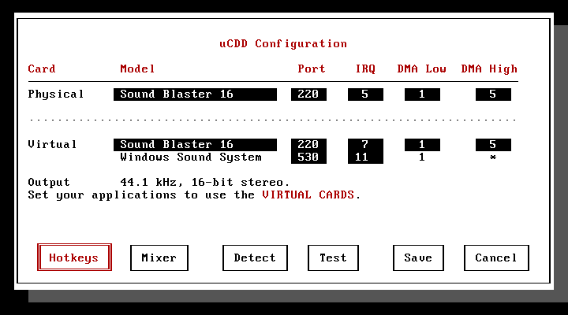
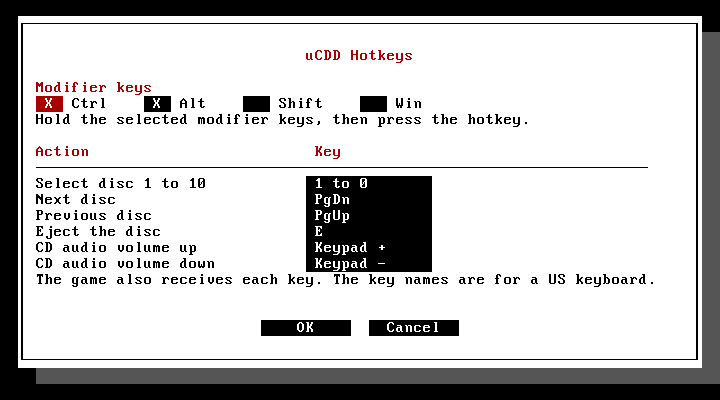
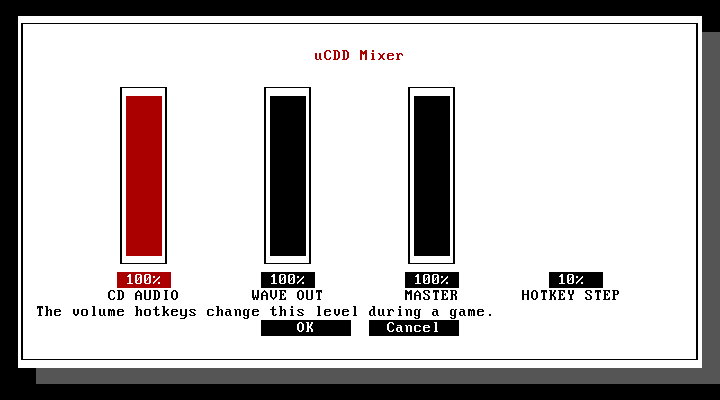
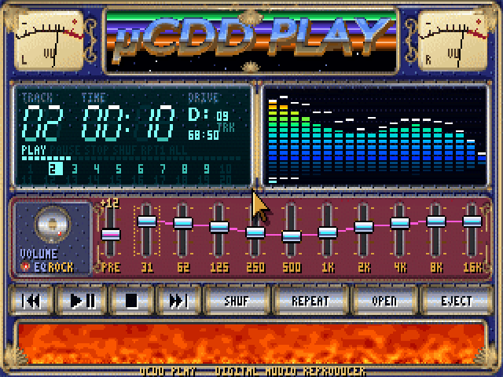

# μCDD

**Eternal betaware**

μCDD is a virtual CD-ROM driver for DOS. It mounts disc images from a local hard disk and plays their CD-Audio through the sound card, mixed with the game's own sound.

## Requirements

- 386 or later, DOS 5 or later, and a CD redirector: [SHSUCDX](http://adoxa.altervista.org/shsucdx/) or MSCDEX.
- For CD-Audio: XMS, VCPI, and an I/O port-trap interface. HIMEM alone does not provide these. μCDD is designed for [JEMMEX](https://github.com/Baron-von-Riedesel/Jemm) 5.86 and 5.87, including the port-trap callback interface changed in 5.87pre1. The published 0.9.0 binary rejects that interface. HIMEM.SYS with EMM386 is best effort; see [Microsoft EMM386 and shared DMA](#microsoft-emm386-and-shared-dma).
- A Sound Blaster (1.5/2.0, Pro, or 16) or a Windows Sound System codec. **Initialize the card before `UCDD -install`.** μCDD does not configure it. Set the jumpers, or run the card's Plug and Play or setup utility (CTCM, UNISOUND, and so on) first.

**Protected-mode game support is incomplete.**

**Note:** CD-Audio performance on anything below a Pentium processor may be lacklustre. Uncompressed audio requires around 800KB/s of constant read speed.

## Setup

Copy `UCDD.EXE` and `UCDDSET.EXE` into one directory and run `UCDDSET`.

<table>
  <tr>
    <td align="center" width="33%">
      <strong>Card settings</strong><br>
      <a href="docs/ucddset.png"></a><br>
      <sub>Set the physical and virtual cards.</sub>
    </td>
    <td align="center" width="33%">
      <strong>Hotkeys</strong><br>
      <a href="docs/ucddset-hotkeys.png"></a><br>
      <sub>Choose resident hotkeys.</sub>
    </td>
    <td align="center" width="33%">
      <strong>Mixer</strong><br>
      <a href="docs/ucddset-mixer.png"></a><br>
      <sub>Set audio levels and volume steps.</sub>
    </td>
  </tr>
</table>

- **Physical** is the card in the machine. μCDD plays the mix on it. For a Plug and Play WSS codec, enter the WSS base address, four ports below the codec index port.
- **Virtual** is what games see: a Sound Blaster (SB16, SB Pro, or SB 1.5/2.0, which report DSP 4.05, 3.02, or 2.01) and a WSS codec. The WSS codec uses the DMA Low channel of the virtual Sound Blaster, and a game can move its IRQ through the WSS board register. Where possible, match the virtual model to the physical card. For example, a virtual SB Pro on an SB Pro-compatible card keeps the game sound in 8-bit stereo and avoids a 16-bit conversion.
- **Detect** reads the physical card from the hardware. `BLASTER` only fills in values that the tests cannot find. **Test** plays a tone on each speaker. Both need DOS without the μCDD audio driver.

`UCDDSET` saves to `UCDD.CFG`. `UCDD -install` runs `UCDDSET`, which copies the settings into the driver and sets `BLASTER` for the virtual Sound Blaster. Other `BLASTER` fields, such as `P330`, are kept. If `UCDD.CFG` is missing or from an older version, the `UCDDSET` menu opens first. Changes take effect at the next boot.

CONFIG.SYS:
```dos
DOS=HIGH,UMB
DEVICE=C:\JEMMEX\JEMMEX.EXE
```

AUTOEXEC.BAT:
```dos
LH C:\UCDD\UCDD.EXE -install
C:\DOS\SHSUCDX.COM /D:UCDD0001 /L:F
```

`MSCDEX` can also assign the drive letter.

Do not load the audio driver for games that use ADPCM sound. ADPCM is not supported or passed through, and its playback commands conflict with the PCM output that μCDD mixes into. Boot without `UCDD -install` for those games. Unmounting an image does not unload the driver.

## How it works

`UCDD.EXE` installs as a DOS CD-ROM device. The redirector assigns its drive letter. The installer is discarded after load.

μCDD traps the game's sound-card I/O and DMA access, converts its PCM sound, and mixes it with CD samples from the image. The physical card plays the combined stream. An internal DPMI host keeps the traps in place for protected-mode games.

## Usage

### Installation

Install once per boot, before the redirector. `UCDD -install -units 2` creates two empty drives (1 to 4). Restart DOS to change the unit count. `LH` loads the resident driver into upper memory when UMBs are available (requires ~50KB of upper memory).

```dos
UCDD -mount C:\IMAGES\GAME.CUE
UCDD -mount C:\IMAGES\DATA.ISO -drive G
UCDD -unmount
UCDD -unmount -drive G
```

Without `-drive`, mount uses the first empty μCDD letter and unmount uses the first mounted one. Close files on a drive before you change its image. A locked drive cannot be changed.

`UCDD /?` and `UCDDSET /?` print command help.

### Multiple discs

Make a text file with a `.MDM` extension and one image path per line:

```text
DISC1.ISO
DISC2.CUE
DISC3.BIN
```

```dos
UCDD -mount C:\IMAGES\GAME.MDM
UCDD -unmount C:\IMAGES\GAME.MDM
```

The first disc is mounted. At the game's disc-change prompt, use the [hotkeys](#hotkeys). A held key selects its disc once. A key with no disc assigned does nothing.

Only one MDM file can be mounted at a time, on one virtual unit. The usual `-drive` selection applies. Mounting a single image over that unit releases the list. It can also be unmounted normally.

Paths may be absolute or relative to the MDM file. A CUE sheet's BIN path is relative to the CUE sheet. Nested MDM files are not supported. Blank lines and spaces at the start or end of a line are ignored. Only the first ten non-empty lines count.

All listed images are opened before the mount replaces the current disc. If a listed image is missing or invalid, the current image stays mounted. Give DOS enough file handles. If the drive is in use, μCDD waits, then applies the last requested disc. MDM files require XMS.

### Hotkeys

| Action | Default |
| --- | --- |
| Select disc 1 to 10 | Ctrl+Alt+1 to Ctrl+Alt+0 (or F1 to F10) |
| Next / previous disc | Ctrl+Alt+PgDn / Ctrl+Alt+PgUp |
| Eject | Ctrl+Alt+E |
| CD-Audio volume up / down | Ctrl+Alt+Keypad + / Ctrl+Alt+Keypad - |

The modifier keys can be any mix of Ctrl, Alt, Shift, and Win. The keys still reach the game. Key names are US layout; on other layouts, use the key in the same position.

Eject makes the drive report no disc and keeps the image open. A disc key, or next or previous disc, inserts a disc again. The hotkeys control the MDM drive, or the first μCDD drive when no MDM file is mounted.

Some BIOSes change the CPU speed with Ctrl+Alt+Keypad + and -. KEYB uses Ctrl+Alt+F1 and Ctrl+Alt+F2.

### Protected-mode games and VCPI

When the audio driver is installed, μCDD hides VCPI from programs. It answers the VCPI detection call (INT 67h, AX=DE00h) with "not available". All other EMS and VCPI calls go to JEMMEX without change.

Many DOS extenders can use DPMI or VCPI. Some, such as PMODE/W and CauseWay, select VCPI first when it is available. In VCPI mode, the extender runs the game in its own protected mode and sends the sound directly to the card. μCDD cannot trap this access, so the game's sound and the CD-Audio stop or conflict. Without VCPI, these extenders use the μCDD DPMI host, which keeps the traps in place.

The internal host runs 32-bit and 16-bit DPMI programs. A DPMI program can start another DPMI program, with up to eight child levels. The host saves the parent program and restores it when the child exits. A child program still sees VCPI. For 16-bit programs, such as programs made with Borland Pascal 7, the host also translates the DOS calls that use protected-mode addresses.

If a program supports only VCPI, install with `UCDD -install -vcpi`. VCPI then stays visible, but the sound of these programs bypasses μCDD.

### Microsoft EMM386 and shared DMA

EMM386's port-trapping interface cannot trap ports below `100h`, which includes the DMA controller registers. A game can therefore replace the DMA settings used for physical audio output.

With EMM386, select different 16-bit DMA channels for the physical and the virtual card in `UCDDSET`. For example, physical DMA High 7 with virtual DMA High 5 avoids the audio failure. Both streams still play through the same sound card.

### Images

Use DOS 8.3 names on a local hard disk. Image files must be smaller than 2 GiB. Images on CD, floppy, or network drives are not supported.

| Format | Notes |
| --- | --- |
| `.ISO` | 2048-byte data sectors |
| `.CUE` / `.BIN` | One BINARY file, sequential tracks, INDEX 01 on each track. INDEX 00 and PREGAP are accepted. The data track can be MODE1/2048, MODE1/2352, or MODE2/2352 with Form 1 sectors |
| `.BIN` alone | MODE1/2352 data, no audio track table. Use a CUE sheet for CD-Audio |
| `.MDM` | Disc list, as above |

PREGAP adds silence without reading sectors from the BIN file. Put PREGAP before the track's INDEX entries. Track positions include these gaps.

`FLAGS PRE` applies CD de-emphasis during playback. `DCP`, `4CH`, and `SCMS` are also accepted. `4CH` audio is treated as stereo; copy-control flags do not restrict playback.

Other MODE2 sector formats, compressed audio, and multi-file CUE sheets are not supported.

### CD player

`UCDDPLAY` plays CD-Audio from μCDD images and physical CD drives in VGA mode. It needs the μCDD audio driver.



- **OPEN** shows CD drives and the images on local hard disks. Select a CD drive to use its disc, or select a CUE sheet, an ISO or BIN image, or an MDM file to mount it. If a physical drive is selected, images mount on the first μCDD drive. **EJECT** unmounts an image or opens the physical drive tray.
- **SHUF** plays the tracks in a random order. **REPEAT** repeats one track or all tracks.
- The equalizer has a preamp, 10 bands from 31 Hz to 16 kHz, and presets. It changes only the CD-Audio, and only while `UCDDPLAY` runs. If the CPU is too slow for it, it stays off.
- Push V or click the bottom window to select Warp Speed, Spectra, Firebars, Lavaflow, Bubbles, Plasma, Tunnel, or Random. Tunnel shows moving wireframe rings. Their speed changes with the audio level.
- Push F1 to see all keys. With a mouse driver, the mouse also works.

`UCDDPLAY D:` selects CD drive D:. Push D to select the next CD drive. When you exit `UCDDPLAY`, the CD-Audio stops.

For a physical disc, load its DOS CD-ROM driver and assign it a drive letter with SHSUCDX (or MSCDEX). The drive and its driver must support digital audio extraction. UDVD2, OAKCDROM.SYS, and VIDE-CDD.SYS were checked with SHSUCDX in 86Box. In UCDDSET, set the **virtual** Sound Blaster model to SB16. This does not require a physical SB16 card. Keep the BLASTER value set by `UCDD -install`.

Physical-disc audio passes through the equalizer and the μCDD audio output. It does not use the drive's internal audio cable. The player also applies de-emphasis to tracks marked with pre-emphasis. Opening the file browser pauses physical-disc playback; push Space to resume after closing it.

Physical-disc playback uses the wave output level set in UCDDSET. The player's volume control adjusts this level further.

## GAMES WITH REDBOOK AUDIO THAT WORK

These are games known to work, not a list of every game that may work.

- Absolute Pinball
- Alien Trilogy
- Alone in the Dark
- Alone in the Dark 2
- Alone in the Dark 3
- Amazing Learning Games with Rayman
- An Elder Scrolls Legend: Battlespire
- Archimedean Dynasty
- Batman Forever: The Arcade Game
- Battle Arena Toshinden
- Battle Chess Enhanced CD-ROM
- Battle Race
- BC Racers
- Betrayal at Krondor
- Big Red Racing
- Blam! Machinehead
- Blood
- Bust-A-Move 2 Arcade Edition
- Carmageddon
- Chasm: The Rift
- Corridor 7: Alien Invasion
- Cyber Police (CYBERPO1.EXE)
- Cyberball
- Descent II
- Descent II: Vertigo Series
- Destruction Derby
- Destruction Derby 2
- Fascination
- Future Wars
- Gobliiins
- Gobliins 2: The Prince Buffoon
- Goblins Quest 3
- Little Big Adventure
- Little Big Adventure 2
- Loom
- Lost in Time
- Pro Pinball: The Web
- Pro Pinball: Timeshock!
- Quake
- Rayman
- Rayman 60 Levels
- Rayman By His Fans
- Rayman Designer
- Realms of Arkania III: Shadows over Riva
- Realms of Arkania: Blade of Destiny (German CD edition)
- Realms of Arkania: Star Trail (German CD edition)
- Return to Zork
- Screamer
- Screamer 2
- Screamer Rally
- ShadowCaster
- The Manhole
- The Secret of Monkey Island
- Tomb Raider

## Build

Assembler sources are in `src/`. NASM is required.

## Special thanks

Thanks to davidmorom on VOGONS for testing games and reporting compatibility problems.

## License

Copyright (C) 2026 vorvek. μCDD is licensed under [GNU GPL version 3 only](LICENSE). No warranty; see the license for its terms.
